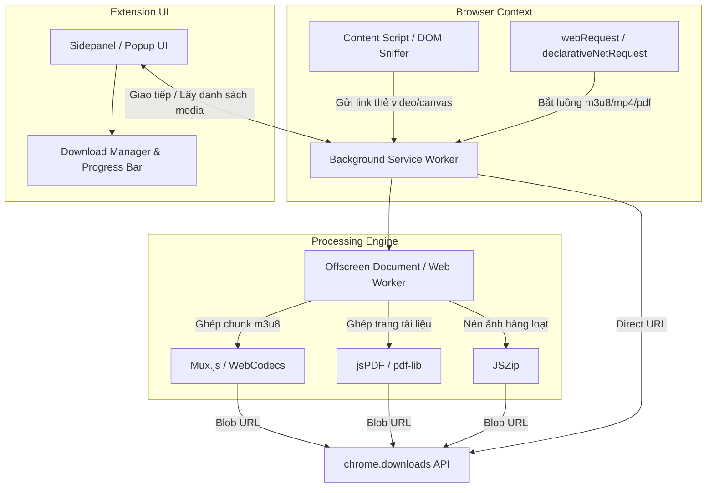

# 🚀 All-in-One Media & Document Downloader Extension
> **Kế hoạch Phát triển, Ý tưởng Tính năng & Kiến trúc Kỹ thuật Chi tiết**

---

## 📌 1. Tổng quan & Tầm nhìn Dự án (Vision & Overview)

Dự án nhằm xây dựng một **Browser Extension (Manifest V3)** đa năng, thông minh và hiện đại, giúp người dùng dễ dàng bắt link và tải về mọi định dạng nội dung từ Internet chỉ với 1 cú click:
- 🎬 **Video/Audio Streaming:** YouTube (chế độ Dev/Firefox/Edge), TikTok, Facebook Reels, Instagram, X/Twitter, Douyin, Bilibili, các web phim/anime.
- 📺 **HLS/DASH Streaming (.m3u8 / .mpd):** Tự động bắt luồng video phân mảnh, tải từng chunk và ghép thành file `.mp4` hoàn chỉnh ngay trên trình duyệt mà không cần cài thêm phần mềm ngoài.
- 📚 **Tài liệu & Học liệu (Study Materials):** Tải tài liệu từ các trang học trực tuyến, các nền tảng xem tài liệu chặn tải (Scribd, Studocu, PDF viewer, Canvas HTML5, Google Docs/Drive viewer).
- 🖼️ **Hình ảnh/Album:** Tải hàng loạt ảnh chất lượng gốc (Full HD, 4K) đóng gói thành file `.zip`.
- ⚡ **Quản lý Download tập trung:** Hỗ trợ tải song song (Multi-threading), tạm dừng/tiếp tục, tự phân loại theo thư mục (Video, Tài liệu, Hình ảnh, Tên trang web).

---

## ⚠️ 2. Lưu ý Pháp lý & Chính sách Trình duyệt (Chrome Web Store Policy)

> [!WARNING]
> **Chính sách của Google Chrome Web Store:**
> Cửa hàng Chrome Web Store **nghiêm cấm tuyệt đối** các extension tải video trực tiếp từ YouTube (vi phạm YouTube TOS).

### 💡 Giải pháp Phân phối Đa kênh (Distribution Strategy):
1. **Bản Chrome Web Store (Standard Version):**
   - Hỗ trợ bắt link mọi trang web (Facebook, TikTok, phim m3u8, tài liệu học tập, ảnh...).
   - Tự động ẩn/tắt tính năng bắt link khi người dùng đang mở tab `youtube.com` để vượt qua vòng kiểm duyệt của Google.
2. **Bản Full Cung cấp Tự do (Developer / Sideload / Edge / Firefox):**
   - Đầy đủ tính năng tải YouTube (4K, 1080p, MP3, Phụ đề .srt).
   - Phân phối qua: Github Releases (file `.zip` cài qua Developer Mode), Microsoft Edge Addons, Firefox Add-ons (Firefox không bị giới hạn chính sách YouTube của Google).

---

## 🎯 3. Các Tính Năng Cốt Lõi (Core Features)

### 3.1. Trình Bắt Link Thông Minh (Universal Media Sniffer)
- **Tự động bắt gói tin mạng (Network Sniffer):** Lắng nghe các request chứa video/audio (`.mp4`, `.webm`, `.mp3`, `.m4a`, `.m3u8`, `.ts`, `.mpd`, `.pdf`).
- **DOM Scanner:** Quét các thẻ `<video>`, `<audio>`, `<iframe>`, `<source>`, `canvas`, `blob:http...` trên trang hiện tại.
- **Badge thông báo số lượng:** Hiển thị số lượng media phát hiện được ngay trên icon extension (ví dụ: `[3]`).

### 3.2. Công nghệ Tải Video HLS Stream (.m3u8 ➡️ MP4)
- Các trang web phim, khóa học trực tuyến thường chia nhỏ video thành hàng ngàn file `.ts` qua file chỉ mục `.m3u8`.
- **Cơ chế xử lý:**
  1. Tải và phân tích nội dung `.m3u8` (lấy danh sách các chunk URL).
  2. Dùng Web Worker tải song song nhiều chunk (tối ưu tốc độ tải).
  3. Sử dụng thư viện `mux.js` hoặc WebCodecs để remux (ghép không nén lại) các chunk `.ts` thành file `.mp4` chuẩn trực tiếp trong bộ nhớ.
  4. Xuất file `.mp4` hoàn chỉnh cho người dùng lưu vào máy tính.

### 3.3. Tải Học liệu & Vượt Chặn Tải Tài liệu (Document Scraper)
- **PDF Viewer Scanner:** Bắt link file PDF gốc được nhúng trong trình duyệt hoặc qua `pdf.js`.
- **Canvas-to-PDF Engine (Dành cho web chặn tải):**
  - Nhiều web học liệu render từng trang tài liệu lên thẻ `<canvas>` hoặc chia thành nhiều ảnh `base64` để chống tải.
  - Extension sẽ tự động scroll qua các trang, chụp/lấy dữ liệu từng thẻ `<canvas>`, sau đó dùng `jsPDF` ghép lại thành 1 file PDF sắc nét đúng thứ tự trang.
- **Tách âm thanh bài giảng:** Chuyển đổi video bài giảng thành file `.mp3` để nghe lại tiện lợi.

### 3.4. Trình Tải Mạng Xã Hội (Social Media Parsers)
- **TikTok / Douyin:** Tải video không logo (No Watermark), tải file nhạc nền (Audio track).
- **Facebook / Instagram:** Bắt link Video HD/Reels/Stories, tải trọn bộ bài viết nhiều ảnh.
- **X (Twitter) / Threads:** Tự động lấy video chất lượng cao nhất (1080p).

### 3.5. Trình Tải Ảnh Hàng Loạt (Bulk Image Downloader)
- Lọc theo kích thước (bỏ qua icon, avatar nhỏ, chỉ lấy ảnh > 600px).
- Xem trước dạng Gallery Grid.
- Chọn lọc ảnh bằng checkbox hoặc "Chọn tất cả".
- Nén tất cả ảnh thành file `.zip` (dùng `JSZip`) với 1 click.

---

## 🏗️ 4. Kiến Trúc Kỹ Thuật (Architecture & Tech Stack)



### Chi tiết các thành phần:
1. **Manifest V3 (`manifest.json`):**
   - Quyền hạn (Permissions): `downloads`, `declarativeNetRequest`, `webRequest`, `storage`, `offscreen`, `activeTab`, `scripting`.
2. **Background Service Worker (`background.js`):**
   - Trung tâm điều phối bắt gói tin và quản lý hàng đợi tải (Download Queue).
3. **Content Script (`content.js` & `injected.js`):**
   - Bắt các API call nội bộ (Hook `window.fetch` và `XMLHttpRequest`), quét DOM lấy canvas và link video blob.
4. **Offscreen Document (`offscreen.html` / `worker.js`):**
   - Nơi xử lý các tác vụ nặng (Xử lý âm thanh, ghép m3u8, tạo PDF, nén ZIP) do Manifest V3 Service Worker không hỗ trợ trực tiếp DOM API.
5. **UI Layer (`sidepanel/` hoặc `popup/`):**
   - Giao diện Dark/Light mode hiện đại, glassmorphism, responsive, hiển thị thumbnail, độ phân giải, dung lượng ước tính.

---

## 📁 5. Cấu Trúc Thư Mục Dự Án Đề Xuất (Folder Structure)

```text
D:\GIT\Extension\Download/
│
├── manifest.json              # Khai báo extension Manifest V3
├── package.json               # (Tùy chọn) Quản lý thư viện: mux.js, jszip, jspdf
│
├── background/
│   ├── background.js          # Service worker chính điều phối bắt link & tải
│   ├── sniffer.js             # Bộ lọc network request bắt m3u8, mp4, pdf
│   └── download_manager.js    # Quản lý tiến trình download, retry, resume
│
├── content_scripts/
│   ├── content.js             # Quét DOM, gửi thông tin media về background
│   ├── hook_fetch.js          # Injected script can thiệp XHR/Fetch để bắt blob url
│   └── canvas_extractor.js    # Quét trang học liệu, chụp canvas tạo PDF
│
├── offscreen/
│   ├── offscreen.html         # Môi trường chạy ngầm các thư viện DOM/WebWorker
│   ├── offscreen.js           # Bộ điều phối xử lý video/pdf/zip
│   ├── hls_merger.js          # Thuật toán tải chunk ts và merge thành mp4 (mux.js)
│   └── doc_generator.js       # Thuật toán ghép ảnh/canvas thành PDF (jsPDF)
│
├── ui/
│   ├── sidepanel.html         # Giao diện SidePanel (hiện ở cạnh phải trình duyệt)
│   ├── sidepanel.css          # Giao diện hiện đại phong cách Dark Glassmorphism
│   ├── sidepanel.js           # Xử lý tương tác nút bấm, lọc danh sách media
│   └── components/
│       ├── media_card.js      # Card hiển thị từng video/ảnh/file
│       └── progress_bar.js    # Thanh tiến trình tải m3u8/file
│
├── lib/                       # Các thư viện độc lập không cần build
│   ├── mux.min.js             # Ghép .ts thành .mp4
│   ├── jszip.min.js           # Nén file zip
│   └── jspdf.umd.min.js       # Tạo file PDF
│
└── assets/
    ├── icons/                 # Logo extension các kích cỡ (16, 32, 48, 128)
    └── badges/
```

---

## 📅 6. Lộ Trình Phát Triển (Development Roadmap)

### 🔹 Giai đoạn 1: Khởi tạo Core Sniffer & Giao diện Cơ bản (MVP)
- [ ] Thiết lập `manifest.json` (MV3) và cấu trúc thư mục.
- [ ] Xây dựng bộ bắt link `webRequest` / `declarativeNetRequest` cho các định dạng cơ bản (`.mp4`, `.mp3`, `.pdf`, `.zip`, `.jpg`, `.png`).
- [ ] Thiết kế giao diện **Sidepanel** cao cấp: Danh sách media phát hiện, bộ lọc (Tất cả, Video, Âm thanh, Tài liệu, Hình ảnh).
- [ ] Gọi `chrome.downloads.download()` để tải các file có direct link.

### 🔹 Giai đoạn 2: Trình tải HLS (.m3u8 Stream Downloader)
- [ ] Bắt link file `.m3u8` từ các web phim/học liệu.
- [ ] Thiết lập **Offscreen Document** và tích hợp `mux.js`.
- [ ] Viết module tải song song các chunk `.ts` với hiển thị tiến trình `%` theo thời gian thực trên UI.
- [ ] Ghép thành file `.mp4` và kích hoạt tải về.

### 🔹 Giai đoạn 3: Trình cào Học liệu & Tài liệu (Canvas & Document Extractor)
- [ ] Viết Content Script tự động cuộn qua các trang tài liệu trên web học liệu.
- [ ] Trích xuất ảnh chất lượng cao từ các thẻ `<canvas>` hoặc image viewer.
- [ ] Dùng `jsPDF` ghép các trang thành file PDF hoàn chỉnh.
- [ ] Tích hợp tính năng tải trọn bộ tài liệu khóa học theo folder.

### 🔹 Giai đoạn 4: Social Media Special Parsers & Batch Downloader
- [ ] Tích hợp parser tải video TikTok (No Watermark), Facebook Reels HD, Instagram.
- [ ] Tích hợp `JSZip` cho phép tải hàng loạt ảnh/file về dưới dạng 1 file `.zip`.
- [ ] Cơ chế đặt tên thông minh: `[Tên Trang] - [Tiêu đề bài viết].[ext]`.

---

## 💰 7. Ý Tưởng Thương Mại Hóa (Monetization Ideas)

1. **Freemium Model:**
   - **Miễn phí:** Tải không giới hạn MP4/MP3 thông thường, tối đa 5 video m3u8/ngày, tải tài liệu < 15 trang.
   - **Bản Pro ($2.99/tháng hoặc $19.99 trọn đời):**
     - Tải m3u8 siêu tốc độ không giới hạn (16 luồng tải song song).
     - Tải tài liệu học tập không giới hạn số trang.
     - Tải video 4K / 8K và tách riêng phụ đề tự động.
2. **Donate / Tip:** Nút "Buy me a coffee" trực tiếp trên thanh công cụ.


- [x] Đã hoàn thiện tính năng Tải Tài Liệu (Background VIP Resolver & In-Browser Harvester không qua web thứ 3).
- [x] Đã hoàn thiện Video YouTube Master Card chọn độ phân giải (1080p, 720p, 480p, 360p, MP3, Phụ đề .srt).
